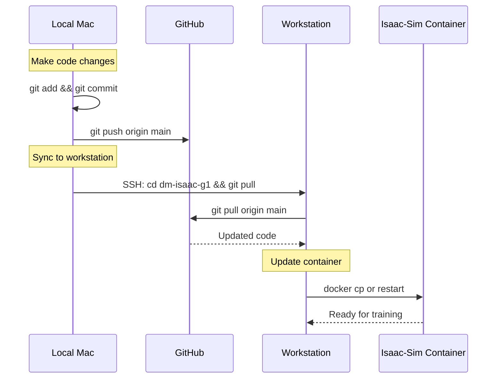

# Agent Workflow Rules

This document defines the standard workflows and best practices for working with the GROOT fine-tuning and G1 robot development environment.

---

## Git Workflow for Workstation Synchronization

**CRITICAL**: All code changes must be committed and synced to the workstation via git.

### Workflow Diagram



### Before Making Changes on Workstation

1. **Always pull latest from git first**:
   ```bash
   # On workstation (via SSH)
   cd /home/datamentors/dm-isaac-g1
   git pull origin main
   ```

2. **Copy updated code to container if needed**:
   ```bash
   docker cp /home/datamentors/dm-isaac-g1 isaac-sim:/workspace/
   ```

### After Making Local Changes

1. **Commit and push**:
   ```bash
   git add -A
   git commit -m "Description of changes"
   git push origin main
   ```

2. **Sync to workstation**:
   ```bash
   source .env
   sshpass -p "$WORKSTATION_PASSWORD" ssh -o StrictHostKeyChecking=no \
       "$WORKSTATION_USER@$WORKSTATION_HOST" \
       "cd /home/datamentors/dm-isaac-g1 && git pull origin main"
   ```

### Quick Sync Command

```bash
# One-liner to push and sync
git push origin main && source .env && sshpass -p "$WORKSTATION_PASSWORD" ssh -o StrictHostKeyChecking=no "$WORKSTATION_USER@$WORKSTATION_HOST" "cd /home/datamentors/dm-isaac-g1 && git pull origin main"
```

---

## Environment Access

### SSH Connection to Workstation

Always use `sshpass` with credentials from `.env` file for non-interactive SSH access:

```bash
source /path/to/dm-isaac-g1/.env
sshpass -p "$WORKSTATION_PASSWORD" ssh -o StrictHostKeyChecking=no datamentors@192.168.1.205 "command"
```

### Docker Container Access

The main work environment is inside the `isaac-sim` Docker container:

```bash
docker exec isaac-sim bash -c 'source /opt/conda/etc/profile.d/conda.sh && conda activate grootenv && your_command'
```

## Directory Structure

### Local Repository (Mac)
```
/Users/elianomarques/Documents/DataScienceProjects/Datamentors/dm-isaac-g1/
├── .env                    # Environment variables (SSH passwords, HF tokens)
├── agent.md               # This file
├── docs/                  # Documentation
│   ├── FINETUNING_LOG.md # Training session logs
│   └── G1_INSPIRE_TRAINING_PLAN.md
├── cleanup/               # Cleanup reference files
│   ├── README.md
│   └── grootenv_main.yml
└── scripts/               # Local utility scripts
```

### Workstation Container (/workspace)
```
/workspace/
├── Isaac-GR00T/           # GROOT fine-tuning framework
│   ├── datasets/          # Datasets (must be in /workspace for container access)
│   ├── scripts/           # Conversion and utility scripts
│   └── *.py configs       # Modality configs (g1_fold_towel_config.py, etc.)
├── checkpoints/           # Model checkpoints
│   ├── groot_g1_full/     # Simulated training checkpoint
│   ├── groot_g1_teleop/   # Real robot data checkpoint
│   └── groot_g1_fold_towel/  # Hospitality task checkpoint
└── IsaacLab/              # Isaac Lab for RL training
```

## Dataset Handling

### GROOT Expected Format

GROOT N1.6 expects datasets in LeRobot v2 format with specific field names:
- `observation.state` - Concatenated state vector
- `action` - Concatenated action vector (NOT `action.action`)
- `observation.images.*` - Video frames

### Converting Unitree Hospitality Datasets

Unitree hospitality datasets (G1_Fold_Towel, G1_Clean_Table, etc.) use individual fields:
- `observation.left_arm`, `observation.right_arm`, etc.
- `action.left_arm`, `action.right_arm`, etc.

Use the conversion script:
```bash
python /workspace/Isaac-GR00T/scripts/convert_g1_format.py \
  --input /path/to/original_dataset \
  --output /path/to/converted_dataset_GROOT
```

### Required Meta Files

Each dataset must have in `meta/`:
1. `info.json` - Dataset info with features
2. `modality.json` - Joint mapping for GROOT
3. `episodes.jsonl` - Episode metadata
4. `tasks.jsonl` - Task descriptions

## Fine-tuning Workflow

### 1. Validate Dataset Before Training

```bash
# Check info.json features
cat /workspace/Isaac-GR00T/datasets/DATASET_NAME/meta/info.json | python3 -c "import json,sys; d=json.load(sys.stdin); print([k for k in d['features'].keys()])"

# Check parquet columns
python3 -c "
import pyarrow.parquet as pq
import glob
files = sorted(glob.glob('/workspace/Isaac-GR00T/datasets/DATASET_NAME/data/chunk-000/*.parquet'))
if files:
    t = pq.read_table(files[0])
    print('Columns:', t.column_names)
"
```

### 2. Run Test Training First

Always run a small test (100 steps) before full training:
```bash
python gr00t/experiment/launch_finetune.py \
  --base-model-path nvidia/GR00T-N1.6-3B \
  --dataset-path /workspace/Isaac-GR00T/datasets/DATASET_GROOT \
  --embodiment-tag NEW_EMBODIMENT \
  --modality-config-path /workspace/Isaac-GR00T/config.py \
  --output-dir /workspace/checkpoints/test_run \
  --max-steps 100 \
  --save-steps 50 \
  --global-batch-size 8
```

### 3. Clean Test Checkpoints

Delete test checkpoints before full training to save disk space:
```bash
rm -rf /workspace/checkpoints/test_run
```

### 4. Run Full Training

```bash
nohup python gr00t/experiment/launch_finetune.py \
  --base-model-path nvidia/GR00T-N1.6-3B \
  --dataset-path /workspace/Isaac-GR00T/datasets/DATASET_GROOT \
  --embodiment-tag NEW_EMBODIMENT \
  --modality-config-path /workspace/Isaac-GR00T/config.py \
  --num-gpus 1 \
  --output-dir /workspace/checkpoints/groot_TASK_NAME \
  --max-steps 5000 \
  --save-steps 1000 \
  --global-batch-size 8 \
  --learning-rate 1e-4 \
  --dataloader-num-workers 4 \
  > /tmp/finetune_TASK.log 2>&1 &
```

### 5. Monitor Training

```bash
tail -f /tmp/finetune_TASK.log
```

## Disk Space Management

### Check Disk Usage
```bash
df -h /workspace
du -sh /workspace/*
```

### Safe Cleanup Targets
- `/root/.cache/uv` - Python package cache
- `/root/.cache/pip` - Pip cache
- `/opt/conda/pkgs` - Conda package cache (`conda clean --all -y`)
- Intermediate checkpoints (keep only final)
- Test training outputs
- Old HuggingFace model caches in `/root/.cache/huggingface/hub/`

### DO NOT Delete
- Base model: `models--nvidia--GR00T-N1.6-3B`
- Final checkpoints (checkpoint-5000)
- Active datasets

## HuggingFace Upload

### Model Upload
```bash
huggingface-cli upload datamentorshf/groot-TASK-NAME /workspace/checkpoints/groot_TASK/checkpoint-5000 . --repo-type model --private
```

### Dataset Download
Use git LFS for large datasets to avoid rate limiting:
```bash
git lfs install
git clone https://huggingface.co/datasets/unitreerobotics/DATASET_NAME
```

## Common Issues & Solutions

### Issue: SSH Permission Denied
**Solution**: Use `sshpass` with password from `.env`

### Issue: Dataset path not found in container
**Solution**: Copy dataset to `/workspace/` (home directory is not mounted in container)

### Issue: `KeyError: 'action'` during training
**Solution**: Dataset uses `action.action` instead of `action`. Re-convert dataset.

### Issue: `Language modality must have exactly one key`
**Solution**: Add `"language": ModalityConfig(delta_indices=[0], modality_keys=["task"])` to config

### Issue: HuggingFace rate limiting (429)
**Solution**: Use git LFS clone instead of `huggingface-cli download`

## Modality Config Template

```python
from gr00t.configs.data.embodiment_configs import register_modality_config
from gr00t.data.types import ModalityConfig, ActionConfig, ActionRepresentation, ActionType, ActionFormat
from gr00t.data.embodiment_tags import EmbodimentTag

config = {
    "video": ModalityConfig(
        delta_indices=[0],
        modality_keys=["cam_name"],
    ),
    "state": ModalityConfig(
        delta_indices=[0],
        modality_keys=["body", "left_arm", "right_arm", "left_gripper", "right_gripper"],
    ),
    "action": ModalityConfig(
        delta_indices=list(range(0, 16)),
        modality_keys=["body", "left_arm", "right_arm", "left_gripper", "right_gripper"],
        action_configs=[
            ActionConfig(rep=ActionRepresentation.ABSOLUTE, type=ActionType.NON_EEF, format=ActionFormat.DEFAULT),
            # ... one per modality_key
        ],
    ),
    "language": ModalityConfig(
        delta_indices=[0],
        modality_keys=["task"],
    ),
}

register_modality_config(config, embodiment_tag=EmbodimentTag.NEW_EMBODIMENT)
```

## Trained Models

| Model | HuggingFace Repo | Dataset | Steps |
|-------|-----------------|---------|-------|
| G1 Loco-Manipulation | [datamentorshf/groot-g1-loco-manip](https://huggingface.co/datamentorshf/groot-g1-loco-manip) | unitree_g1.LMPnPAppleToPlateDC | 5000 |
| G1 Teleop | [datamentorshf/groot-g1-teleop](https://huggingface.co/datamentorshf/groot-g1-teleop) | g1-pick-apple | 4000 |
| G1 Fold Towel | (training in progress) | G1_Fold_Towel | 5000 |

---

## Workstation Scripts Reference

Scripts that exist on the workstation container but should be migrated to this repo:

### Data Preparation Scripts (`/workspace/scripts/`)

| Script | Purpose | Status |
|--------|---------|--------|
| `fix_episodes.py` | Create missing episodes.jsonl and tasks.jsonl | To migrate |
| `split_parquet.py` | Split combined parquet into per-episode files | To migrate |
| `compute_stats.py` | Compute normalization statistics for datasets | To migrate |
| `fix_video_structure.py` | Restructure video directories for GROOT | To migrate |
| `complete_split.py` | Complete partial parquet splits | To migrate |
| `convert_to_inspire.py` | Convert datasets to Inspire format | ✅ In repo |
| `combine_inspire_datasets.py` | Combine multiple datasets | ✅ In repo |

### Isaac-GR00T Scripts (`/workspace/Isaac-GR00T/`)

| Script | Purpose | Status |
|--------|---------|--------|
| `download_dataset.py` | HuggingFace dataset downloader | To migrate |
| `download_all_meta.py` | Download dataset metadata | To migrate |
| `download_meta.py` | Download single dataset metadata | To migrate |
| `g1_teleop_config.py` | Teleop dataset modality config | To migrate |
| `g1_fold_towel_config.py` | Hospitality task modality config | To migrate |
| `g1_inspire_simple_config.py` | Simple Inspire config | To migrate |
| `g1_inspire_unified_config.py` | Full 53 DOF Inspire config | ✅ In repo |

### Note on Script Migration

See [RESTRUCTURING_PLAN.md](./RESTRUCTURING_PLAN.md) for the full plan to migrate these scripts into a proper Python package structure.
