# DM-ISAAC-G1 Architecture & Flow Diagrams

This document provides visual diagrams of the system architecture, inference flows, and training pipelines.

## System Overview

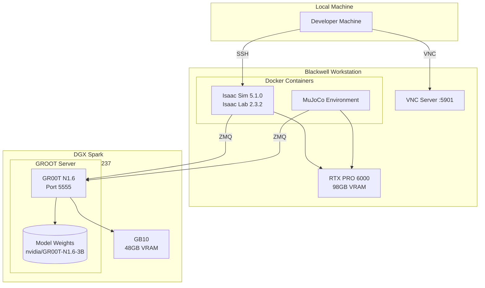

## Physics Engine Compatibility

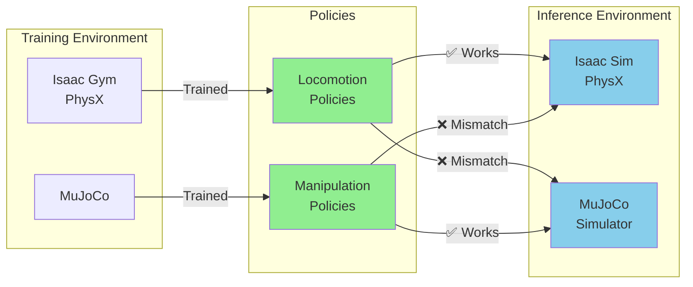

## Track 1: Locomotion Inference (Isaac Sim)

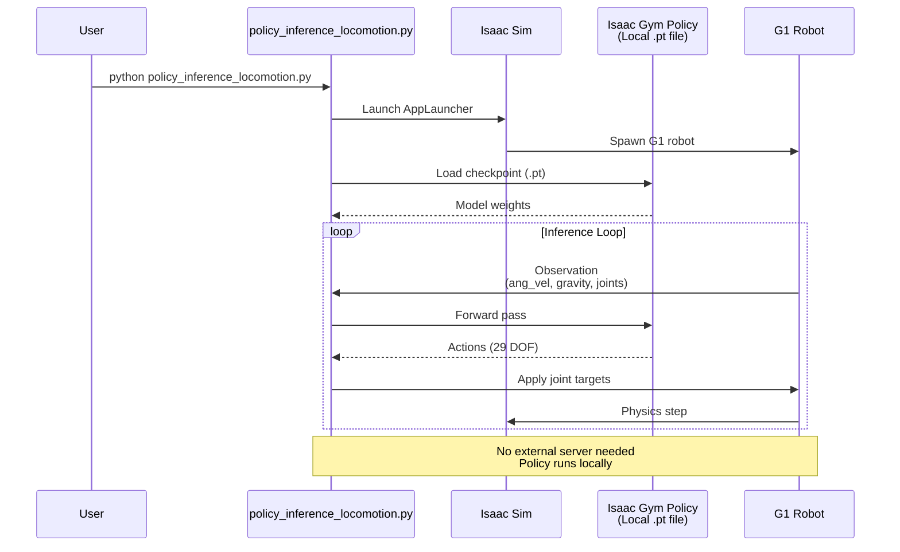

## Track 2: Manipulation Inference (MuJoCo)

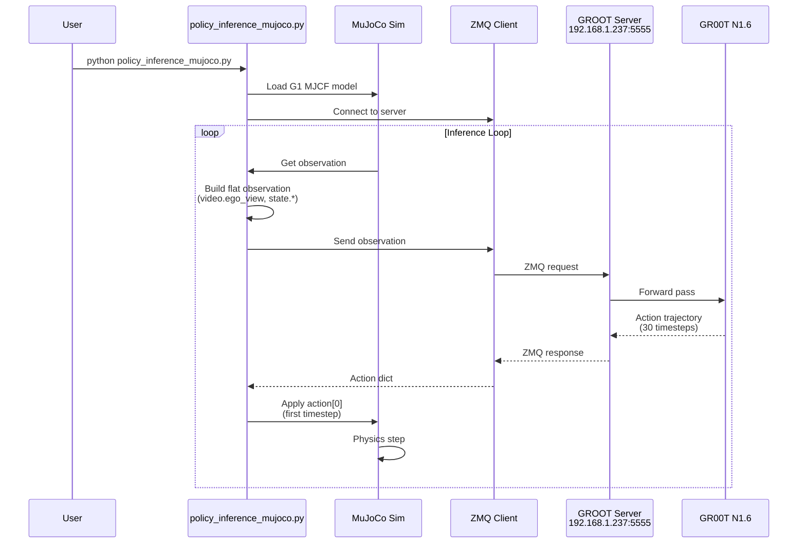

## Track 3: Fine-Tuning Pipeline

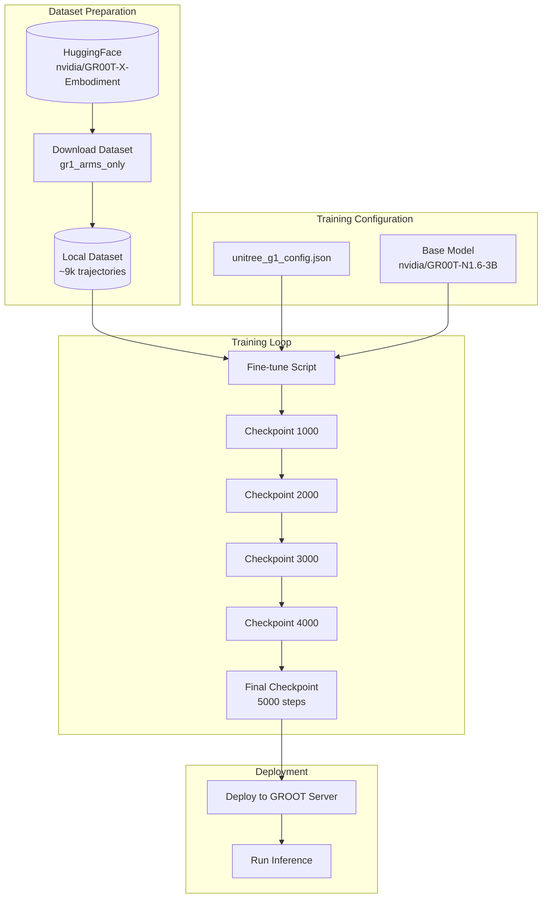

## Observation Format (SimPolicyWrapper)

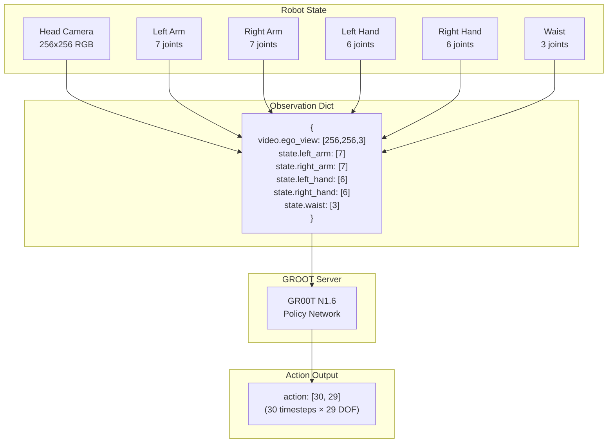

## Action Application Flow

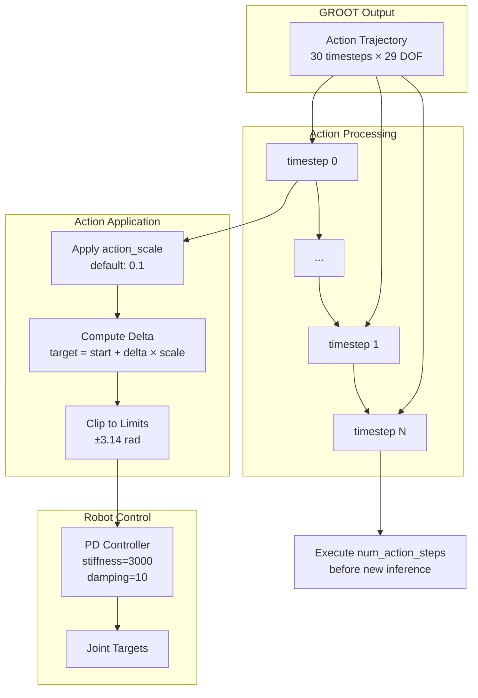

## Infrastructure Setup

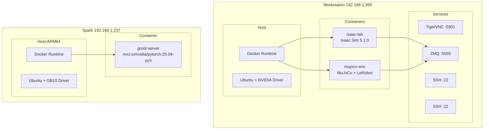

## Overnight Fine-Tuning Workflow

```mermaid
gantt
    title Overnight Fine-Tuning Timeline
    dateFormat HH:mm
    axisFormat %H:%M

    section Preparation
    SSH & Setup           :prep, 22:00, 15m
    Download Dataset      :download, after prep, 45m
    Configure Training    :config, after download, 10m

    section Training
    Initialize Model      :init, 23:10, 10m
    Training Steps 0-1000 :t1, after init, 100m
    Checkpoint 1000       :milestone, after t1, 0m
    Training Steps 1001-2000 :t2, after t1, 100m
    Checkpoint 2000       :milestone, after t2, 0m
    Training Steps 2001-3000 :t3, after t2, 100m
    Checkpoint 3000       :milestone, after t3, 0m
    Training Steps 3001-4000 :t4, after t3, 100m
    Checkpoint 4000       :milestone, after t4, 0m
    Training Steps 4001-5000 :t5, after t4, 100m
    Final Checkpoint      :crit, milestone, after t5, 0m

    section Morning
    Verify Results        :verify, 07:30, 15m
    Deploy to Server      :deploy, after verify, 15m
    Test Inference        :test, after deploy, 30m
```

## File Structure

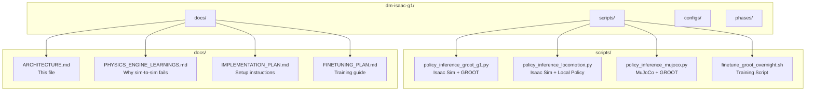

## Quick Reference: Which Script to Use

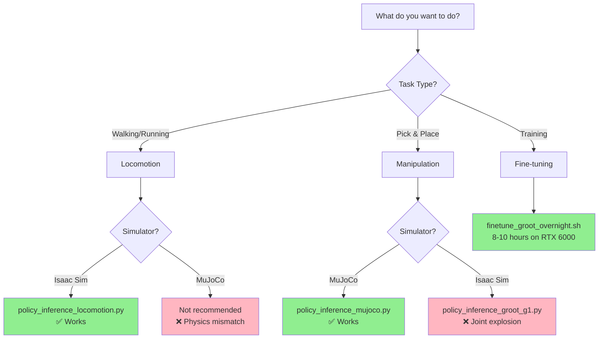

## Connection Details

| Service | Host | Port | Protocol | Purpose |
|---------|------|------|----------|---------|
| Workstation SSH | 192.168.1.205 | 22 | SSH | Remote access |
| VNC Server | 192.168.1.205 | 5901 | VNC | GUI visualization |
| GROOT Server | 192.168.1.237 | 5555 | ZMQ | Policy inference |
| Spark SSH | 192.168.1.237 | 22 | SSH | Server management |

## Environment Variables

See `.env` file for credentials and sensitive configuration. Key variables:

| Variable | Description |
|----------|-------------|
| `WORKSTATION_HOST` | Blackwell workstation IP (192.168.1.205) |
| `GROOT_SERVER_HOST` | DGX Spark server IP (192.168.1.237) |
| `GROOT_SERVER_PORT` | GROOT ZMQ port (5555) |
| `GROOT_MODEL_PATH` | Model path or HuggingFace ID |
| `HF_TOKEN` | HuggingFace access token |

## VNC Access for Visualization

The Blackwell workstation has VNC pre-installed for visualizing Isaac Sim and other GUI applications.

### VNC Connection Details

| Setting | Value |
|---------|-------|
| Host | 192.168.1.205 |
| Port | 5901 |
| Display | :1 |
| Password | (see .env) |

### Connecting with VNC Viewer

1. **macOS**: Use "Screen Sharing" app or any VNC client
   ```
   vnc://192.168.1.205:5901
   ```

2. **Windows/Linux**: Use TigerVNC, RealVNC, or Remmina
   ```
   192.168.1.205:5901
   ```

### Running Isaac Sim with Visualization

```bash
# SSH to workstation
ssh datamentors@192.168.1.205

# Set display for VNC
export DISPLAY=:1

# Run Isaac Sim with rendering (not headless)
cd /path/to/IsaacLab
./isaaclab.sh -p scripts/play.py \
    --task Isaac-Stack-RgyBlock-G129-Inspire-Joint \
    --num_envs 1

# Or using unitree_sim_isaaclab directly
cd /path/to/unitree_sim_isaaclab
python sim_main.py --device cuda --enable_cameras \
    --task Isaac-Stack-RgyBlock-G129-Inspire-Joint \
    --robot_type g129
```

### VNC Troubleshooting

```bash
# Check if VNC server is running
ps aux | grep -E 'vnc|Xvnc' | grep -v grep

# Check display
echo $DISPLAY
ls -la /tmp/.X11-unix/

# Start VNC if not running (usually already running)
vncserver :1 -geometry 1920x1080 -depth 24

# Kill and restart VNC
vncserver -kill :1
vncserver :1
```
