# GR00T Whole-Body Control (WBC) — Deep Dive

A comprehensive study of NVIDIA's [GR00T-WholeBodyControl](https://github.com/NVlabs/GR00T-WholeBodyControl) repository: the architecture, every major component, how they interact, and where our Dex1 modifications fit in.

---

## Table of Contents

1. [Repository Overview](#1-repository-overview)
2. [The Three Packages](#2-the-three-packages)
3. [decoupled_wbc — Core Control Framework](#3-decoupled_wbc--core-control-framework)
4. [gear_sonic — Simulation & Teleoperation](#4-gear_sonic--simulation--teleoperation)
5. [gear_sonic_deploy — Real Robot C++ Stack](#5-gear_sonic_deploy--real-robot-c-stack)
6. [Communication Architecture](#6-communication-architecture)
7. [The Policy System](#7-the-policy-system)
8. [Simulation Integration](#8-simulation-integration)
9. [The SONIC Process](#9-the-sonic-process)
10. [Our Dex1 Modifications](#10-our-dex1-modifications)
11. [Key File Reference](#11-key-file-reference)

---

## 1. Repository Overview

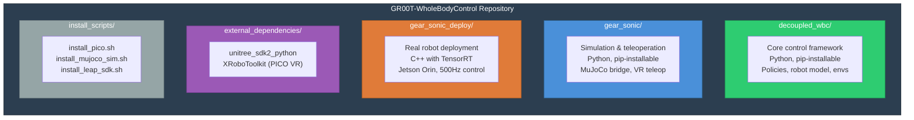

### What Lives Where

| Directory | Language | Install | Purpose |
|-----------|----------|---------|---------|
| `decoupled_wbc/` | Python | `pip install -e decoupled_wbc/[full]` | Control policies, robot model, environments, RoboCasa integration |
| `gear_sonic/` | Python | `pip install -e gear_sonic/[sim]` | MuJoCo sim bridge, VR teleop, image streaming |
| `gear_sonic_deploy/` | C++ | CMake build | Real-time control on Jetson/robot hardware |
| `external_dependencies/` | Mixed | Vendored | Unitree SDK2 Python + XRoboToolkit (PICO VR) |
| `install_scripts/` | Shell | Run directly | Environment setup (venvs, dependencies) |

### Key Design Principles

1. **Decoupled upper/lower body** — GROOT controls arms+waist+hands; a separate RL policy controls legs for balance/locomotion
2. **Hardware-agnostic interface** — DDS (Unitree SDK2) is the universal transport; same code runs on real robot and in sim
3. **Modular policies** — Upper body (interpolation), lower body (ONNX RL), and whole-body (composition) are separate, swappable modules
4. **Sim-to-real parity** — MuJoCo simulation publishes the exact same DDS messages as the real robot

---

## 2. The Three Packages

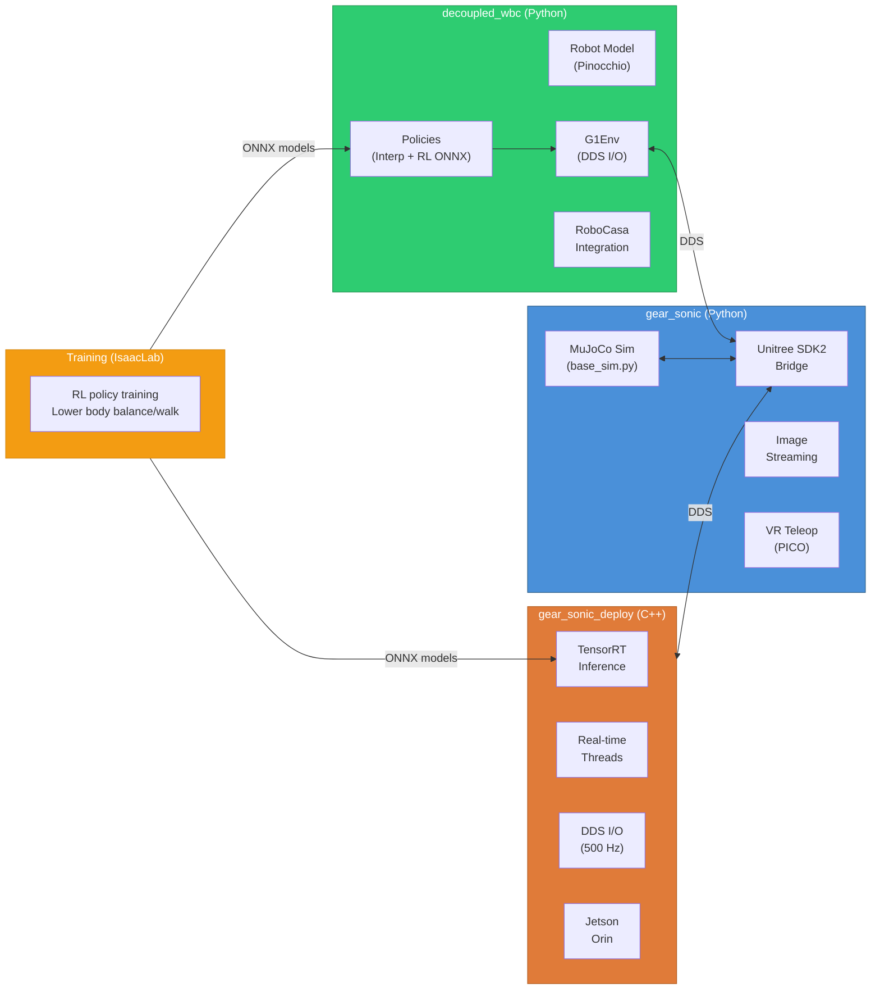

### Package Dependencies

```
decoupled_wbc[full]:
  numpy==1.26.4, scipy==1.15.3, torch
  pinocchio (Pinocchio FK/IK), mujoco, onnxruntime
  hydra-core, ray, pygame, pyrealsense2, lerobot

gear_sonic[sim]:
  numpy==1.26.4, scipy==1.15.3, torch
  mujoco, tyro, pinocchio, pyyaml

gear_sonic[teleop]:
  pyzmq, msgpack, pinocchio, pyvista

gear_sonic_deploy:
  TensorRT, ONNX Runtime, CUDA Toolkit
  Unitree SDK2 (C++), ROS2 Humble (optional)
```

---

## 3. decoupled_wbc — Core Control Framework

This is the heart of the system. It defines **what** the robot should do.

### 3.1 Robot Model (`control/robot_model/`)

The robot model is built on **Pinocchio** (rigid-body dynamics library) and provides FK, IK, Jacobians, and gravity compensation.

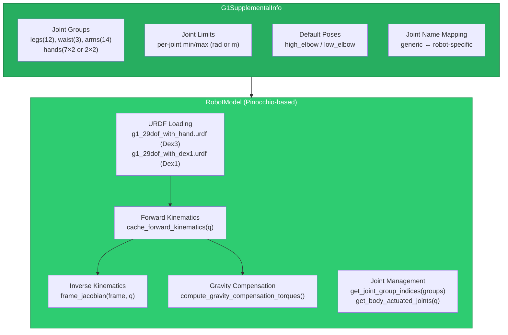

**Key classes:**

- **`RobotModel`** — Wraps Pinocchio model. Loads URDF, provides FK (`cache_forward_kinematics`), frame poses (`frame_placement`), Jacobians (`frame_jacobian`), gravity compensation (`compute_gravity_compensation_torques`). Total DOF = 7 (floating base) + 29 (body) = 36.
- **`ReducedRobotModel`** — Fixes certain joints to create lower-DOF models for constrained IK.
- **`G1SupplementalInfo`** — Encodes everything not in the URDF: joint groups (hierarchical), joint limits, default poses, hand frame names, waist location mode.
- **`instantiate_g1_robot_model()`** — Factory function in `instantiation/g1.py` that wires everything together.

**Joint group hierarchy:**

```
body (29 DOF)
├── legs (12)
│   ├── left_leg (6): hip_pitch/roll/yaw, knee, ankle_pitch/roll
│   └── right_leg (6): same
├── waist (3): yaw, roll, pitch
└── arms (14)
    ├── left_arm (7): shoulder_p/r/y, elbow, wrist_r/p/y
    └── right_arm (7): same

hands (variable)
├── left_hand: 7 DOF (Dex3) or 2 DOF (Dex1)
└── right_hand: 7 DOF (Dex3) or 2 DOF (Dex1)

Composite groups:
  upper_body = arms + hands
  lower_body = legs + waist (configurable)
```

**Waist location modes** (critical for control split):
- `LOWER_BODY` (default) — waist controlled by RL leg policy
- `UPPER_BODY` — waist controlled by interpolation/IK with arms
- `LOWER_AND_UPPER_BODY` — both policies claim waist (lower overwrites)

### 3.2 Environment System (`control/envs/g1/`)

The environment is the robot's interface to hardware or simulation.

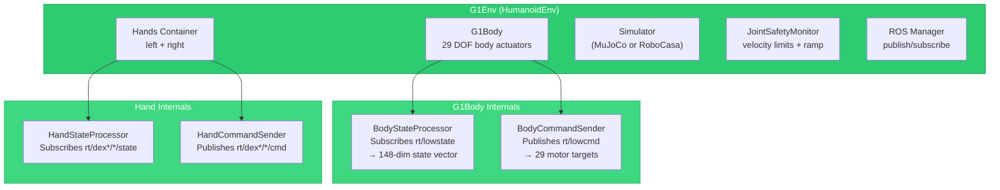

**G1Env** — Main environment class. Composes:
- `G1Body` — manages 29 body joints via DDS
- `G1Dex1Hand` or `G1ThreeFingerHand` — manages hand joints via DDS
- `JointSafetyMonitor` — enforces velocity limits (arms: 6 rad/s, hands: 50 rad/s) with 2-second startup ramp
- Simulator (optional, for sim mode)
- ROS2 node (for bridge communication)

**Key methods:**
- `observe()` → returns `{q, dq, ddq, tau_est, floating_base_pose, floating_base_vel, wrist_pose, ...}`
- `queue_action(action_dict)` → maps from joint order to actuator order, sends via DDS
- `get_eef_obs()` → FK-based wrist pose computation

**State vector from real robot (148 dims):**

```
Position:  [x,y,z, qw,qx,qy,qz, q0..q28]     (7 + 29 = 36)
Velocity:  [vx,vy,vz, wx,wy,wz, dq0..dq28]    (6 + 29 = 35)
Torque:    [_, _, _, _, _, _, tau0..tau28]       (6 + 29 = 35)
Accel:     [ax,ay,az, _, _, _, ddq0..ddq28]     (6 + 29 = 35)
IMU:       [torso_qw,qx,qy,qz, wx,wy,wz]       (7)
                                            Total: 148
```

### 3.3 DDS Interface (`control/envs/g1/utils/`)

**BodyStateProcessor** — subscribes to `rt/lowstate` (LowState_hg message type). Reads motor_state[i].{q, dq, tau_est} for all 29 body motors. Also reads `rt/secondary_imu` for torso quaternion/angular velocity. Outputs the 148-dim state vector.

**BodyCommandSender** — publishes to `rt/lowcmd` (LowCmd_hg). Sets motor_cmd[motor_index].{q, dq, tau, kp, kd, mode} for each motor. Uses `JOINT2MOTOR` mapping to convert from joint order to actuator order (they differ on the real robot).

**HandStateProcessor** — subscribes to `rt/dex3/{left,right}/state` or `rt/dex1/{left,right}/state`. Reads hand motor states.

**HandCommandSender** — publishes to `rt/dex3/{side}/cmd` or `rt/dex1/{side}/cmd`. Sets hand motor targets with appropriate mode bitfield.

### 3.4 Joint Safety Monitor (`control/envs/g1/utils/joint_safety.py`)

Enforces per-joint velocity limits to prevent damage:

| Joint Group | Velocity Limit |
|-------------|---------------|
| Arms | 6.0 rad/s |
| Hands | 50.0 rad/s |
| Legs | Not monitored (RL handles) |

Features:
- **Startup ramp** — 2-second linear ramp from 0 to full velocity limit, prevents jerky starts
- **Action clamping** — if commanded velocity exceeds limit, clamp the target position
- Optional Rerun visualization for debugging

---

## 4. gear_sonic — Simulation & Teleoperation

This package provides the MuJoCo simulation environment and VR teleoperation stack.

### 4.1 What is "SONIC"?

**SONIC** is NVIDIA's whole-body control foundation model — a unified policy trained on large-scale human motion data for natural locomotion and manipulation. The name appears in configurations as `sonic_model12` (the 12th iteration).

Key capabilities:
- Single unified policy for walking, turning, height control, manipulation
- Real-time VR teleoperation (PICO VR headset)
- Kinematic planner for motion generation
- Supports G1 with 29 body DOF + 14 hand DOF (Dex3) or 4 hand DOF (Dex1)

### 4.2 MuJoCo Simulation Engine

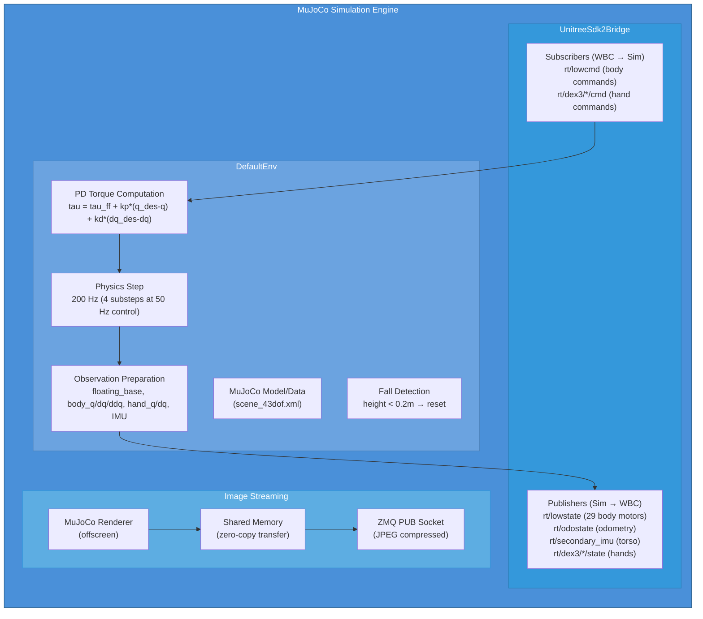

**DefaultEnv** — The core MuJoCo environment:
- Loads `scene_43dof.xml` (G1 + scene)
- Steps physics at 200 Hz (4 substeps per 50 Hz control tick)
- Computes PD torques: `tau = tau_ff + kp*(q_des - q) + kd*(dq_des - dq)`
- Detects falls (robot height < 0.2m)
- Prepares observations from MuJoCo state

**UnitreeSdk2Bridge** — The key abstraction that makes sim-to-real possible:
- **Publishers** (sim → WBC policy):
  - `rt/lowstate` → 29 body motor states (q, dq, ddq, tau_est)
  - `rt/odostate` → floating base position/velocity/orientation
  - `rt/secondary_imu` → torso IMU (quaternion + angular velocity)
  - `rt/dex3/{left,right}/state` → hand motor states
- **Subscribers** (WBC policy → sim):
  - `rt/lowcmd` → 29 body motor commands (q_des, dq_des, tau_ff, kp, kd)
  - `rt/dex3/{left,right}/cmd` → hand motor commands

**Image streaming** — Runs in a separate subprocess to avoid blocking the sim:
1. MuJoCo offscreen renderer captures camera images
2. Images transferred via shared memory (zero-copy)
3. JPEG-compressed and broadcast via ZMQ PUB socket
4. Bridge or external systems subscribe to receive

### 4.3 Configuration

**SimLoopConfig (dataclass):**

```python
wbc_version: "sonic_model12"
interface: "sim"         # or "real", "lo"
simulator: "mujoco"
sim_frequency: 200       # Hz (physics)
control_frequency: 50    # Hz (policy)
enable_waist: True
with_hands: True
enable_offscreen: False  # camera rendering
enable_natural_walk: False
```

**WBC YAML** (`g1_29dof_sonic_model12.yaml`):
- Robot type, scene XML path
- Per-motor PD gains (kp, kd)
- Motor velocity/effort limits
- Observation dimensions and scales
- History length (4 frames for temporal context)

### 4.4 VR Teleoperation

**pico_manager_thread_server.py** — Receives body tracking from PICO VR headset:
1. PICO headset → SMPL human pose (body + hands)
2. Server converts human pose → G1 joint angles via IK
3. Publishes targets via ZMQ for WBC to interpolate toward
4. Optional visualization with pyvista

---

## 5. gear_sonic_deploy — Real Robot C++ Stack

Production-grade C++ application for deploying policies on the actual robot hardware.

### 5.1 Architecture

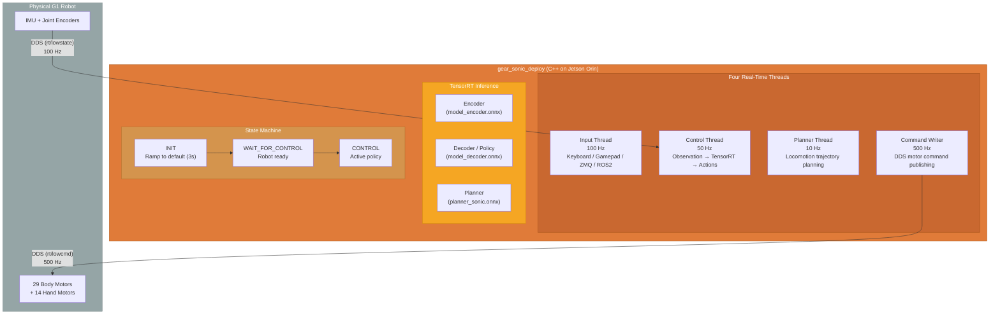

### 5.2 Key Differences from Python Stack

| Aspect | decoupled_wbc (Python) | gear_sonic_deploy (C++) |
|--------|----------------------|------------------------|
| **Language** | Python | C++ (C++20) |
| **Inference** | ONNX Runtime (CPU) | TensorRT (GPU, FP16, CUDA graphs) |
| **Latency** | ~10-20ms | <1ms (CUDA graph captured) |
| **Threads** | Single loop at 50 Hz | 4 threads: 100/50/10/500 Hz |
| **Target** | Workstation | Jetson Orin (on-robot) |
| **CRC** | No validation | CRC validation on real hardware |
| **Safety** | Joint velocity limits | + CRC + emergency stop + state machine |

### 5.3 Input & Output Interfaces

**Input interfaces** (pluggable via `--input-type`):
- `keyboard` — terminal keyboard control
- `gamepad` — Xbox/gamepad
- `zmq_manager` — network ZMQ server (for external control)
- `ros2` — ROS2 topic subscription (`ControlPolicy/upper_body_pose`)
- `manager` — intelligent fallback (gamepad → keyboard)

**Output interfaces** (via `--output-type`):
- `zmq` — state broadcast over network
- `ros2` — state broadcast via ROS2 (`G1Env/env_state_act`)
- `all` — both simultaneously

### 5.4 Deployment Flow

```bash
# 1. Build
cd gear_sonic_deploy && ./deploy.sh

# 2. Run in simulation
./deploy.sh sim     # Uses loopback interface (lo0)

# 3. Run on real robot
./deploy.sh real    # Auto-detects 192.168.123.x interface
```

The `deploy.sh` script handles: TensorRT check, model file verification, system deps, environment setup, CMake build, and launches the executable with appropriate arguments.

---

## 6. Communication Architecture

The entire system is built on three communication protocols, each serving a different purpose.

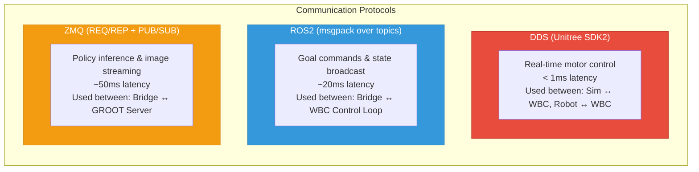

### 6.1 DDS Topics (Unitree SDK2)

The DDS layer provides the real-time motor-level interface. These are the same topics whether talking to a real robot or a MuJoCo simulation.

**State topics (robot/sim → WBC):**

| Topic | Message Type | Content | Rate |
|-------|-------------|---------|------|
| `rt/lowstate` | `LowState_` | 29 body motor states (q, dq, ddq, tau_est) + pelvis IMU | 500 Hz |
| `rt/odostate` | `OdoState_` | Floating base position/velocity (sim only) | 500 Hz |
| `rt/secondary_imu` | `IMUState_` | Torso IMU quaternion + angular velocity | 500 Hz |
| `rt/dex3/{left,right}/state` | `HandState_` | 7 hand motor states per hand | 500 Hz |
| `rt/dex1/{left,right}/state` | `HandState_` | 2 hand motor states per hand (our Dex1) | 500 Hz |

**Command topics (WBC → robot/sim):**

| Topic | Message Type | Content | Rate |
|-------|-------------|---------|------|
| `rt/lowcmd` | `LowCmd_` | 29 body motor targets (q, dq, tau, kp, kd) | 500 Hz |
| `rt/dex3/{left,right}/cmd` | `HandCmd_` | 7 hand motor targets per hand | 500 Hz |
| `rt/dex1/{left,right}/cmd` | `HandCmd_` | 2 hand motor targets per hand (our Dex1) | 500 Hz |

### 6.2 ROS2 Topics (Bridge ↔ WBC)

The ROS2 layer carries higher-level goal commands and assembled state between the WBC control loop and the bridge.

| Topic | Direction | Content |
|-------|-----------|---------|
| `G1Env/env_state_act` | WBC → Bridge | Assembled whole-body state: q[43], dq[43], wrist_pose[14], action[43] |
| `ControlPolicy/upper_body_pose` | Bridge → WBC | Target: upper_body_pose[17], target_time, navigate_cmd[3], base_height |

### 6.3 ZMQ (Bridge ↔ GROOT Server)

| Pattern | Direction | Content |
|---------|-----------|---------|
| REQ/REP | Bridge → GROOT → Bridge | Observation dict in, 30-step action trajectory out |
| PUB/SUB | Sim → Bridge (images) | Camera images (JPEG compressed, base64) |

---

## 7. The Policy System

The core innovation: **upper body and lower body are controlled by completely different policies**, composed at runtime.

### 7.1 Policy Hierarchy

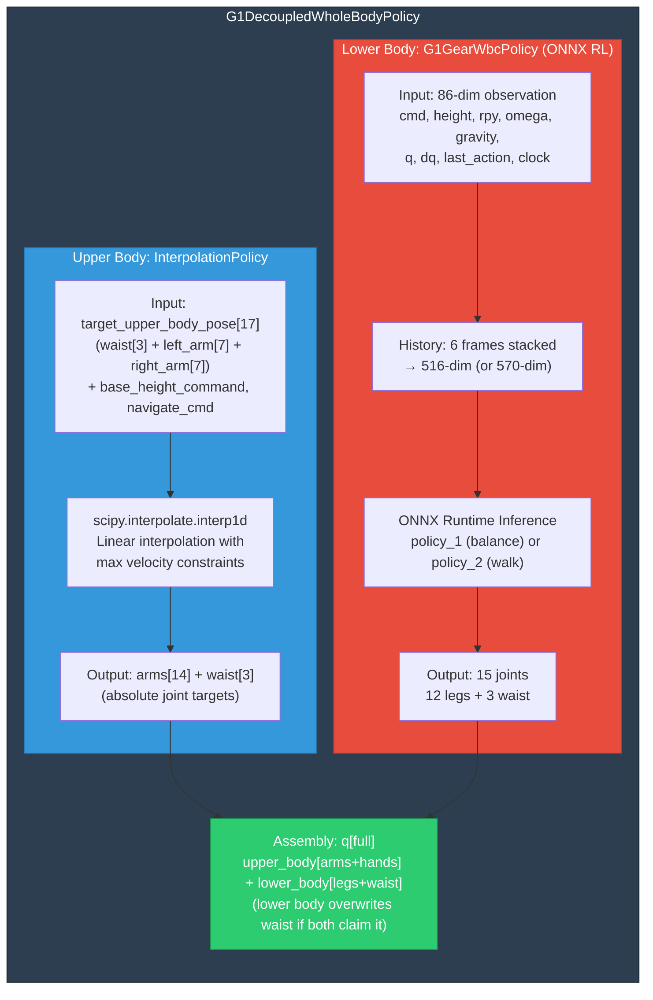

### 7.2 InterpolationPolicy (Upper Body)

**Purpose:** Smoothly interpolate upper body joints toward targets received from the bridge (which come from GROOT inference).

**Core class: `PoseTrajectoryInterpolator`**
- Uses `scipy.interpolate.interp1d` for linear interpolation
- Enforces maximum change rate (velocity limit) when scheduling waypoints
- Garbage-collects old waypoints to prevent unbounded memory growth

**Input (from bridge via ROS2):**

```python
goal = {
    "target_upper_body_pose": [17 floats],  # waist(3) + left_arm(7) + right_arm(7)
    "target_time": float,                    # when to reach this pose
    "base_height_command": [1 float],        # robot base height (default 0.74m)
    "navigate_cmd": [3 floats],              # [vx, vy, omega]
}
```

**Output (at each control tick):**

```python
action = {
    "target_upper_body_pose": [17 floats],   # interpolated to current time
    "base_height_command": [1 float],
    "navigate_cmd": [3 floats],
}
```

### 7.3 G1GearWbcPolicy (Lower Body RL)

**Purpose:** Control legs for balance (standing) and locomotion (walking) using RL policies trained in IsaacLab.

**Two ONNX models:**
- `Balance.onnx` — used when `||navigate_cmd|| < 0.05` (standing still)
- `Walk.onnx` — used when `||navigate_cmd|| >= 0.05` (moving)

**Observation construction (86 dims per frame):**

| Component | Dims | Description |
|-----------|------|-------------|
| cmd × cmd_scale | 3 | Navigate command [vx, vy, omega] |
| base_height | 1 | Robot height |
| omega × ang_vel_scale | 3 | Angular velocity (from IMU) |
| gravity_direction | 3 | Projected gravity in body frame |
| (q - defaults) × dof_pos_scale | 15 | Joint position offsets |
| dq × dof_vel_scale | 15 | Joint velocities |
| last_action | 15 | Previous action output |
| clock_inputs | 4 | Gait phase (sin/cos at freq_cmd) |
| **Total per frame** | **86** | |
| **× 6 history frames** | **516** | (or 570 with additional features) |

**Action output:**

```python
action = default_angles + raw_output * action_scale  # 15 dims: 12 legs + 3 waist
```

**Keyboard control (for manual testing):**
- `w/s`: forward/backward, `a/d`: strafe, `q/e`: rotate
- `1/2`: height up/down, `3-8`: roll/pitch/yaw
- `]/o`: toggle policy on/off

### 7.4 G1DecoupledWholeBodyPolicy (Composition)

**Purpose:** Merge upper and lower body actions into a single whole-body command.

**Control flow:**

```
1. set_observation(obs)     → only passes to lower body policy
2. set_goal(goal)           → splits into upper/lower goals:
   - Upper: target_upper_body_pose, base_height, target_time
   - Lower: toggle_stand_command, toggle_policy_action
3. get_action(time):
   a. upper_action = interpolation_policy.get_action(time)
   b. Extract arm positions + base height + torso RPY (via FK)
   c. lower_action = gear_wbc_policy.get_action(arms, height, rpy, cmd)
   d. Merge: q[upper_indices] = upper, q[lower_indices] = lower
   e. Return full q[43]
```

**Safety timeout:** If no new goal received for 1 second (in teleop mode), resets to safe default pose.

### 7.5 Policy Factory

```python
get_wbc_policy(
    robot_type="g1",
    robot_model=RobotModel,
    wbc_config=config_dict,
    init_time=time.monotonic()
) → G1DecoupledWholeBodyPolicy
```

Creates the composed policy with appropriate upper (InterpolationPolicy) and lower (G1GearWbcPolicy) sub-policies based on configuration.

---

## 8. Simulation Integration

### 8.1 MuJoCo Simulation

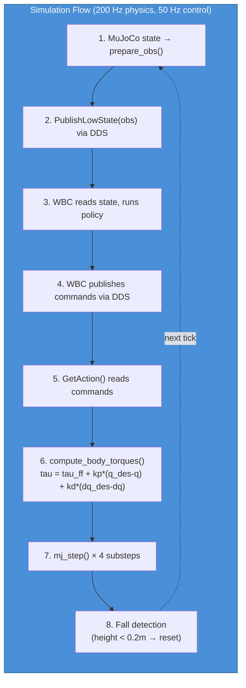

**Key: The simulation appears identical to the real robot** from the WBC policy's perspective. It publishes the same DDS messages, subscribes to the same command topics. The WBC policy code doesn't know (or care) whether it's talking to a real robot or MuJoCo.

### 8.2 RoboCasa Integration

RoboCasa provides realistic manipulation environments (kitchens, tables, etc.) with rich object interactions.

**Key classes:**
- `Gr00tObsActionConverter` — converts between WBC joint order and RoboCasa/Robosuite joint order
- `SyncEnv` — wraps RoboCasa environment with the WBC whole-body interface
- Handles action dict splitting: body joints → body part, gripper joints → gripper part

**Environment naming convention:**

```
gr00tlocomanip_g1_sim/LMPnPAppleToPlateDC_G1_gear_wbc         (Dex3)
gr00tlocomanip_g1_dex1_sim/LMPnPAppleToPlateDC_G1Dex1_gear_wbc (Dex1)
```

### 8.3 SimulatorFactory

Creates the appropriate simulator based on config:

```python
SimulatorFactory.create_simulator(config) → BaseSimulator or RoboCasaG1EnvServer
SimulatorFactory.start_simulator(sim)     → spawns threads/subprocesses
```

---

## 9. The SONIC Process

SONIC (whole-body control foundation model) is the latest evolution of NVIDIA's WBC system. Here's how the complete SONIC process works end-to-end:

### 9.1 Complete System Flow

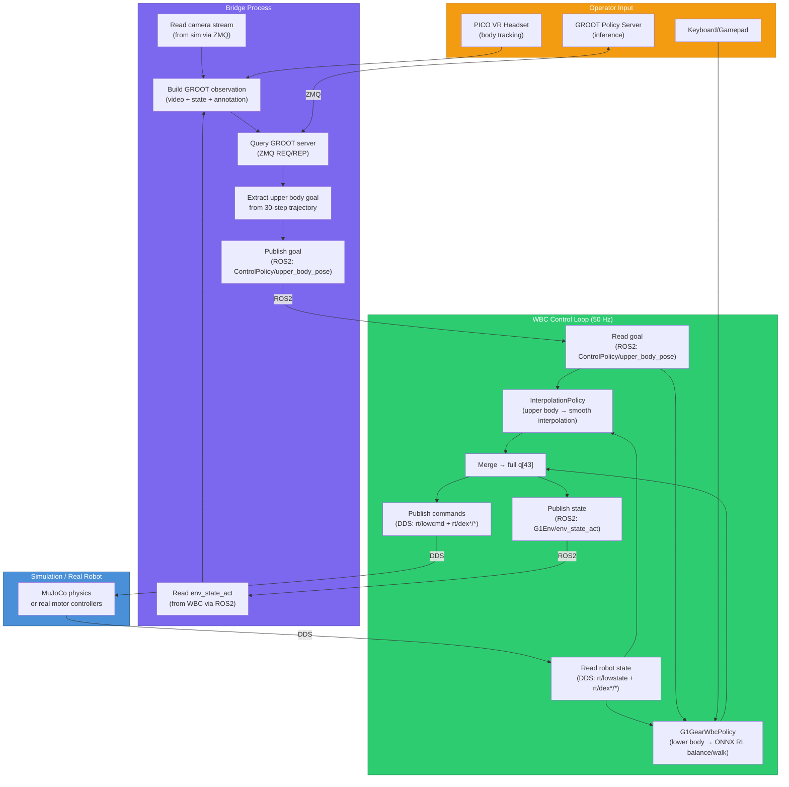

### 9.2 Timing & Frequencies

| Component | Frequency | Latency Budget |
|-----------|-----------|----------------|
| MuJoCo physics | 200 Hz | 5ms |
| WBC control loop | 50 Hz | 20ms |
| DDS command publishing | 500 Hz (deploy) | 2ms |
| GROOT inference | ~5-10 Hz | 100-200ms |
| Planner re-planning | 10 Hz | 100ms |
| Image streaming | 30 Hz | 33ms |
| VR tracking | 90 Hz | 11ms |

### 9.3 SONIC vs Decoupled WBC

The `sonic_model12` configuration is the latest SONIC model. Key differences from older decoupled WBC:

| Aspect | Decoupled WBC (older) | SONIC (current) |
|--------|----------------------|-----------------|
| Lower body policy | 2 models (balance + walk) | Unified foundation model |
| Observation | 86 dims × 6 history | 120 dims × 4 history |
| Training data | RL only | Large-scale human motion data |
| Locomotion | Basic walk/balance | Natural human-like motion |
| Planner | None | ONNX kinematic planner |
| VR teleop | Basic | Full-body PICO integration |

---

## 10. Our Dex1 Modifications

Our hospitality model was trained with `UNITREE_G1` embodiment on Dex1 data (1 DOF per hand). NVIDIA's standard pipeline uses Dex3 (7 DOF per hand). We parameterized the pipeline to support both.

### 10.1 What Changed

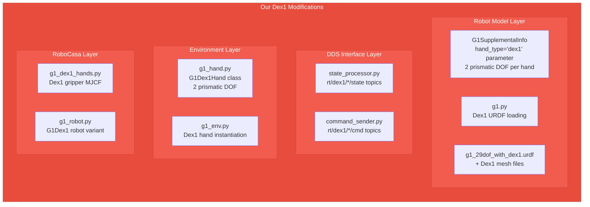

### 10.2 What Auto-Adapts (No Changes Needed)

These components derive DOF counts from the robot model, so they work with any hand type:

- `G1DecoupledWholeBodyPolicy` — uses group indices from robot model
- `SyncEnv` — derives DOF counts from `RobotModel`
- `Gr00tObsActionConverter` — reads joint groups from `G1SupplementalInfo`
- ONNX lower body policy — only controls legs+waist, hand-agnostic

### 10.3 DOF Comparison

| | Dex3 (standard) | Dex1 (ours) |
|---|---|---|
| **Body** | 29 DOF | 29 DOF |
| **Left hand** | 7 DOF (revolute) | 2 DOF (prismatic) |
| **Right hand** | 7 DOF (revolute) | 2 DOF (prismatic) |
| **Total** | **43 DOF** | **33 DOF** |
| **DDS hand topics** | `rt/dex3/*/` | `rt/dex1/*/` |
| **URDF** | `g1_29dof_with_hand` | `g1_29dof_with_dex1` |
| **Gym env** | `*_G1_gear_wbc` | `*_G1Dex1_gear_wbc` |

### 10.4 Dex1 Value Conversion

Physical range: [-0.02, 0.024] meters (prismatic)
Training range: [5.4, 0.0] (inverted!)

```python
# Physical → Training: inverted linear map
training_value = 5.4 - (physical_value + 0.02) * (5.4 / 0.044)
```

---

## 11. Key File Reference

### decoupled_wbc/

| File | Purpose |
|------|---------|
| `control/robot_model/robot_model.py` | `RobotModel` + `ReducedRobotModel` (Pinocchio wrapper) |
| `control/robot_model/supplemental_info/g1/g1_supplemental_info.py` | Joint groups, limits, defaults, hand configs |
| `control/robot_model/instantiation/g1.py` | `instantiate_g1_robot_model()` factory |
| `control/envs/g1/g1_env.py` | `G1Env` main environment class |
| `control/envs/g1/g1_body.py` | `G1Body` body actuator interface |
| `control/envs/g1/g1_hand.py` | `G1ThreeFingerHand`, `G1Dex1Hand` |
| `control/envs/g1/utils/state_processor.py` | DDS subscribers (BodyStateProcessor, HandStateProcessor) |
| `control/envs/g1/utils/command_sender.py` | DDS publishers (BodyCommandSender, HandCommandSender) |
| `control/envs/g1/utils/joint_safety.py` | `JointSafetyMonitor` |
| `control/policy/interpolation_policy.py` | `InterpolationPolicy` (upper body trajectory smoothing) |
| `control/policy/g1_gear_wbc_policy.py` | `G1GearWbcPolicy` (lower body ONNX RL) |
| `control/policy/g1_decoupled_whole_body_policy.py` | `G1DecoupledWholeBodyPolicy` (composition) |
| `control/policy/wbc_policy_factory.py` | `get_wbc_policy()` factory |
| `control/main/teleop/run_g1_control_loop.py` | Main 50 Hz control loop |
| `control/main/teleop/configs/g1_gear_wbc.yaml` | WBC policy configuration |
| `dexmg/gr00trobocasa/` | RoboCasa integration (Gr00tObsActionConverter, SyncEnv) |
| `sim2mujoco/resources/robots/g1/policy/` | ONNX model files (Balance.onnx, Walk.onnx) |

### gear_sonic/

| File | Purpose |
|------|---------|
| `scripts/run_sim_loop.py` | Main simulation entry point |
| `scripts/pico_manager_thread_server.py` | VR teleop server |
| `utils/mujoco_sim/base_sim.py` | `DefaultEnv` MuJoCo simulation |
| `utils/mujoco_sim/unitree_sdk2py_bridge.py` | `UnitreeSdk2Bridge` DDS bridge |
| `utils/mujoco_sim/simulator_factory.py` | `SimulatorFactory` |
| `utils/mujoco_sim/configs.py` | `BaseConfig`, `SimLoopConfig` |
| `utils/mujoco_sim/sensor_server.py` | ZMQ image streaming |
| `utils/mujoco_sim/image_publish_utils.py` | Shared memory image transfer |
| `utils/mujoco_sim/wbc_configs/g1_29dof_sonic_model12.yaml` | SONIC model config |
| `data/robot_model/robot_model.py` | Pinocchio robot model (gear_sonic copy) |

### gear_sonic_deploy/

| File | Purpose |
|------|---------|
| `deploy.sh` | Main deployment script (build + run) |
| `src/g1/g1_deploy_onnx_ref/src/g1_deploy_onnx_ref.cpp` | `G1Deploy` class (4 real-time threads) |
| `src/g1/g1_deploy_onnx_ref/include/control_policy.hpp` | TensorRT policy inference |
| `src/g1/g1_deploy_onnx_ref/include/encoder.hpp` | Observation encoder |
| `src/g1/g1_deploy_onnx_ref/include/localmotion_kplanner*.hpp` | Locomotion planner |
| `src/g1/g1_deploy_onnx_ref/include/input_interface/` | Input handlers (keyboard, gamepad, ZMQ, ROS2) |
| `src/g1/g1_deploy_onnx_ref/include/output_interface/` | Output handlers (ZMQ, ROS2) |
| `src/TRTInference/InferenceEngine.h` | TensorRT GPU inference wrapper |
| `policy/release/` | ONNX model files (encoder, decoder, planner) |
| `docker/Dockerfile.ros2` | Multi-platform Docker image |
| `CMakeLists.txt` | C++20 build config with TensorRT/CUDA |
