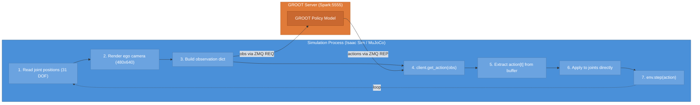
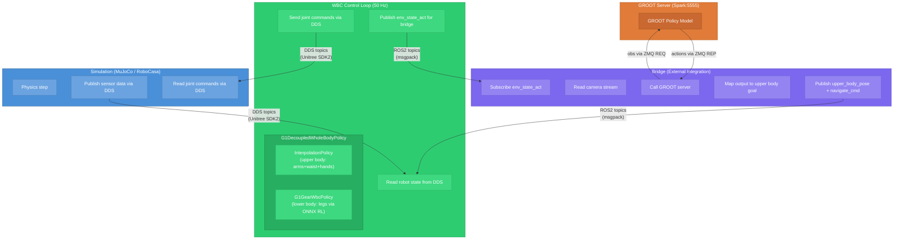
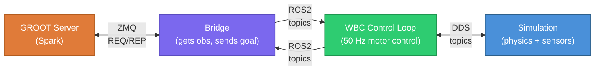
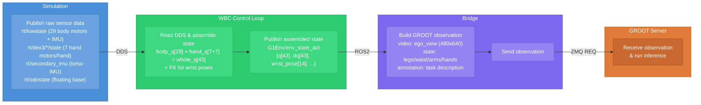
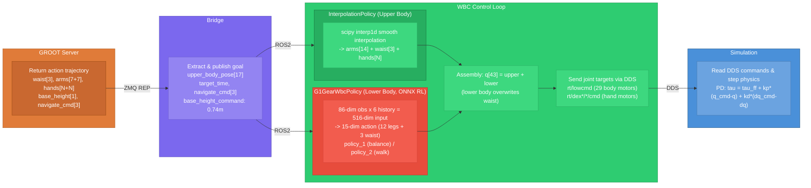
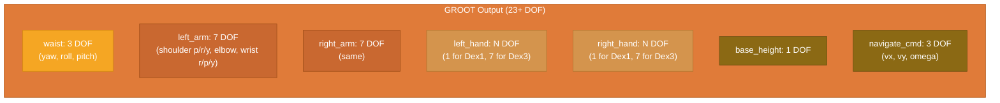
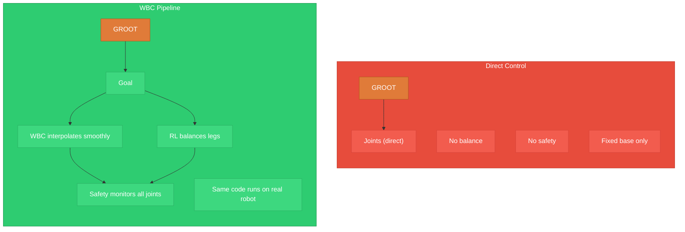

# Inference Architecture Comparison: Direct Control vs WBC Pipeline

Comparison of how our G1 robot runs inference in two different architectures:
1. **Direct Control** — our original approach (dm-isaac-g1)
2. **WBC Pipeline** — NVIDIA's GR00T Whole-Body Control (GR00T-WholeBodyControl)

Both use the same GROOT model server for policy inference, but differ fundamentally in how observations reach the model and how model outputs become robot joint commands.

---

## 1. Direct Control Architecture (Original)

Simple 2-process setup: one simulation, one GROOT model server.



### Observation Format

The simulation reads joint positions directly and packages them into the GROOT observation format:

```
observation = {
    "video": {
        "ego_view": (1, 1, 480, 640, 3) uint8
    },
    "state": {
        "left_leg":   (1, 1, 6)  float32    ─┐
        "right_leg":  (1, 1, 6)  float32     │ 31 DOF total
        "waist":      (1, 1, 3)  float32     │ (read from sim joint positions)
        "left_arm":   (1, 1, 7)  float32     │
        "right_arm":  (1, 1, 7)  float32     │
        "left_hand":  (1, 1, 1)  float32     │ gripper (normalized 0-1)
        "right_hand": (1, 1, 1)  float32    ─┘
    },
    "annotation": {
        "human.task_description": [["fold the towel"]]
    }
}
```

### Action Format

GROOT returns a 30-step action trajectory. The eval script executes some number of steps before re-querying:

```
action_dict = {
    "action.waist":      (1, 30, 3)   ABSOLUTE
    "action.left_arm":   (1, 30, 7)   RELATIVE (delta from trajectory start)
    "action.right_arm":  (1, 30, 7)   RELATIVE (delta from trajectory start)
    "action.left_hand":  (1, 30, 1)   ABSOLUTE
    "action.right_hand": (1, 30, 1)   ABSOLUTE
    "action.base_height_command": (1, 30, 1)  ABSOLUTE (ignored in fixed-base)
    "action.navigate_command":    (1, 30, 3)  ABSOLUTE (ignored in fixed-base)
}
```

**Key: arms use relative deltas** — `target = start_pos + delta * action_scale`.

### Action Application

```python
for t in range(num_action_steps):
    # Extract action at timestep t
    for group in ["waist", "left_arm", "right_arm", "left_hand", "right_hand"]:
        if group in ("left_arm", "right_arm"):
            target = trajectory_start_pos + action[t] * action_scale  # relative
        else:
            target = action[t]  # absolute

    # Apply directly to joint targets via PD controller
    for _ in range(control_decimation):
        env.step(target_joint_positions)
```

### Key Characteristics

| Property | Value |
|----------|-------|
| Processes | 2 (sim + GROOT server) |
| Communication | ZMQ REQ/REP only |
| Robot base | **Fixed** (no walking) |
| Balance controller | **None** |
| Lower body | Observed only, NOT controlled |
| Hand type | 1 DOF gripper (Dex1) |
| State dims | 31 DOF (legs observed, not controlled) |
| Action dims | 23 DOF (waist + arms + hands + nav + height) |
| Action horizon | 30 steps, execute K before re-query |
| Camera | 1 ego-view |
| Frequency | Sim-rate / control_decimation |
| Action type | Mixed (relative arms, absolute rest) |

### Limitations

1. **Fixed base only** — robot cannot walk, must be placed at the task
2. **No balance** — legs are passive; if base isn't fixed, robot falls over
3. **No locomotion** — `navigate_command` and `base_height_command` are in the action output but have no effect without a controller to execute them
4. **Tight coupling** — observation building and action application are embedded in the eval script, making it hard to swap sim backends

---

## 2. WBC Pipeline Architecture (NVIDIA GR00T-WholeBodyControl)

3-process architecture with decoupled control. The key innovation: **the GROOT model only controls the upper body, while a separate RL-trained policy controls the legs for balance and locomotion**.



### How the 3 Processes Communicate



The bridge **never talks to the sim directly**. It only reads published state from the WBC loop and publishes goal commands back.

### Observation Flow (Sim → WBC → Bridge → GROOT)



### Action Flow (GROOT → Bridge → WBC → Sim)



### Key Characteristics

| Property | Value |
|----------|-------|
| Processes | 3 (sim + WBC control loop + GROOT server) + bridge |
| Communication | DDS (sim↔WBC) + ROS2 (WBC↔bridge) + ZMQ (bridge↔GROOT) |
| Robot base | **Free-floating** (walks, balances) |
| Balance controller | **RL-trained ONNX policy** (2 models: balance + walk) |
| Lower body | Actively controlled by RL policy at 50 Hz |
| Hand type | Configurable: Dex3 (7 DOF) or Dex1 (2 DOF) |
| State dims | 43 DOF with Dex3, 33 DOF with Dex1 |
| Action dims | 43 DOF with Dex3, 33 DOF with Dex1 |
| Control frequency | 50 Hz (with 4 physics substeps at 200 Hz) |
| Camera | Ego-view + optional wrist cameras |
| Action type | Absolute targets (interpolated) |

---

## 3. Side-by-Side Comparison

| Aspect | Direct Control | WBC Pipeline |
|--------|---------------|--------------|
| **Processes** | 2 (sim + GROOT) | 3+ (sim + WBC + GROOT + bridge) |
| **Robot stability** | Fixed base required | Self-balancing (RL) |
| **Walking** | No | Yes (velocity commands) |
| **GROOT controls** | Arms + waist + hands | Arms + waist + hands (same) |
| **Leg control** | None (passive) | RL policy (ONNX, 50 Hz) |
| **Action application** | Direct to joints | Interpolated + safety-monitored |
| **Action space** | Mixed (relative arms) | Absolute targets |
| **Safety** | Clip to ±3.14 | Joint limits + velocity monitoring + startup ramp |
| **Sim coupling** | Tight (in eval script) | Loose (DDS interface) |
| **Real robot** | Not supported | Same code, same DDS interface |
| **Sim backends** | Isaac Sim or MuJoCo | MuJoCo or RoboCasa (same DDS) |

### What GROOT Actually Controls (Same in Both)

In both architectures, the GROOT model predicts the **same thing**: upper body joint targets.



The difference is what happens AFTER GROOT produces its output:

- **Direct Control**: joint targets go straight to the sim PD controller. No balance, no interpolation, no safety checks.
- **WBC Pipeline**: joint targets become a "goal" that the WBC policy interpolates toward while simultaneously running an RL balance controller for the legs.

### Why WBC Matters for Real Deployment



---

## 4. Our Dex1 Modifications to the WBC Pipeline

Our hospitality model was trained with `UNITREE_G1` embodiment on Dex1 data (1 DOF per hand), but NVIDIA's standard WBC pipeline uses Dex3 (7 DOF per hand). We parameterized the pipeline to support both.

### What Changed

| Layer | Change | Files |
|-------|--------|-------|
| Robot model | `hand_type="dex1"` param, Dex1 URDF + meshes | `g1_supplemental_info.py`, `g1.py`, `g1_29dof_with_dex1.urdf` |
| DDS interface | Dynamic topics `rt/dex1/*/cmd,state`, dof=2 | `command_sender.py`, `state_processor.py` |
| Hand env | `G1Dex1Hand` class (2 prismatic DOF) | `g1_hand.py`, `g1_env.py` |
| RoboCasa sim | Dex1 gripper MJCF + `G1Dex1` robot variant | `g1_dex1_hands.py`, `g1_robot.py`, MJCF XMLs |

### What Did NOT Change (Auto-Adapts)

- `G1DecoupledWholeBodyPolicy` — uses group indices from robot model, no hand-specific logic
- `SyncEnv` — derives DOF counts from `RobotModel`
- `Gr00tObsActionConverter` — reads joint groups from `G1SupplementalInfo`
- ONNX lower body policy — only controls legs+waist, hand-agnostic

### DOF Comparison

| | Dex3 (standard) | Dex1 (our model) |
|---|---|---|
| **Body** | 29 DOF | 29 DOF |
| **Left hand** | 7 DOF | 2 DOF |
| **Right hand** | 7 DOF | 2 DOF |
| **Total** | **43 DOF** | **33 DOF** |
| **DDS hand topics** | `rt/dex3/*/` | `rt/dex1/*/` |
| **URDF** | `g1_29dof_with_hand` | `g1_29dof_with_dex1` |
| **Gym env** | `*_G1_gear_wbc` | `*_G1Dex1_gear_wbc` |

---

## 5. Running Inference

### Direct Control (Old)

```bash
# Terminal 1: GROOT server on Spark
python scripts/eval/run_groot_server.py \
    --model-path /path/to/checkpoint \
    --embodiment-tag UNITREE_G1

# Terminal 2: Eval on workstation
python scripts/eval/run_mujoco_towel_eval.py \
    --groot-host 192.168.1.237 \
    --groot-port 5555 \
    --num-episodes 10
```

### WBC Pipeline (New, with Dex1)

```bash
# Terminal 1: GROOT server on Spark
python gr00t/eval/run_gr00t_server.py \
    --model-path /path/to/checkpoint \
    --embodiment-tag UNITREE_G1 \
    --use-sim-policy-wrapper

# Terminal 2: WBC eval on workstation
$WBC_PY gr00t/eval/rollout_policy.py \
    --n_episodes 5 \
    --env_name gr00tlocomanip_g1_dex1_sim/LMPnPAppleToPlateDC_G1Dex1_gear_wbc \
    --policy_client_host 192.168.1.237 \
    --policy_client_port 5555 \
    --n_action_steps 20
```
