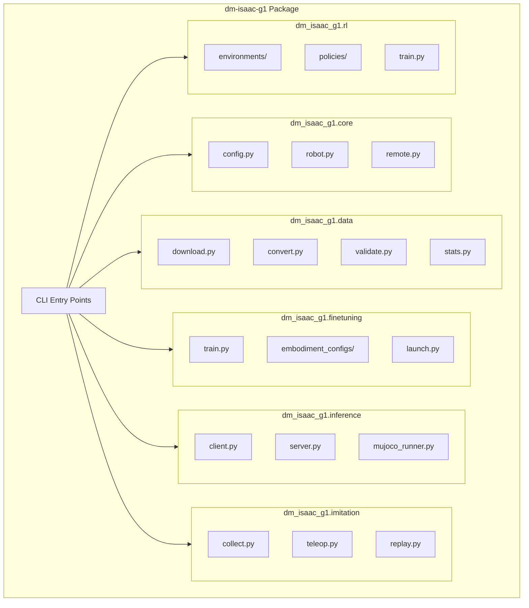
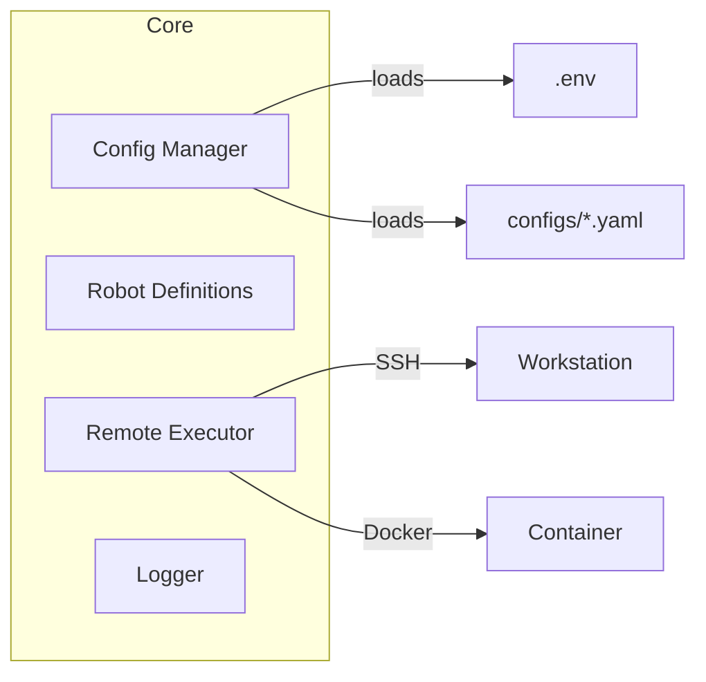
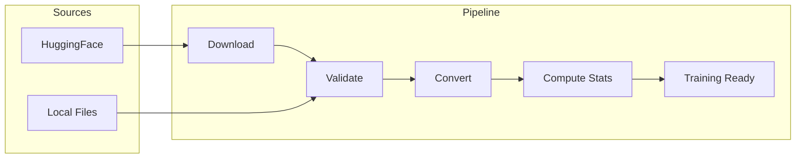
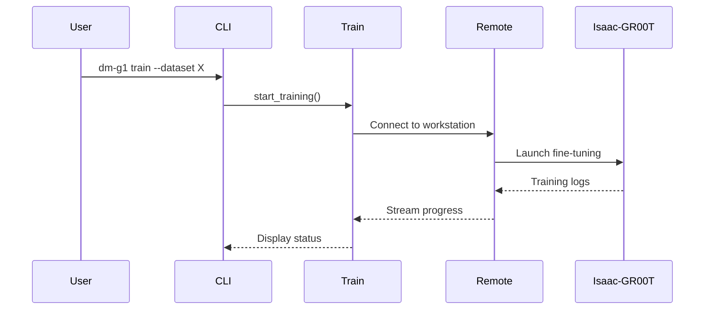
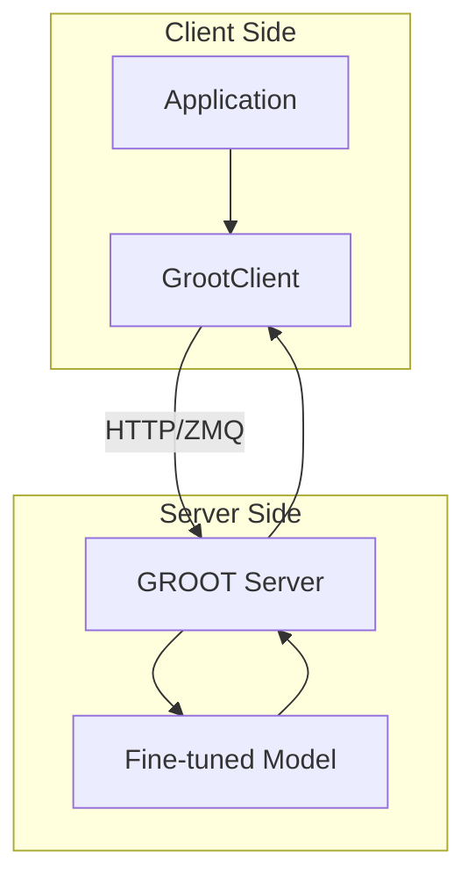
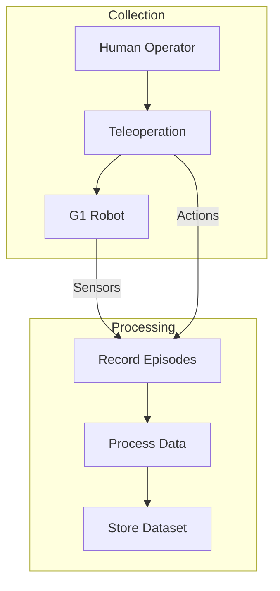
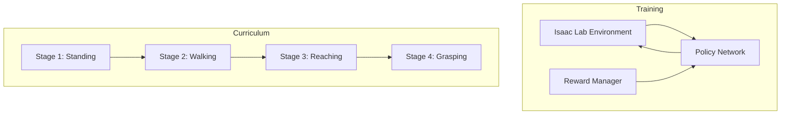
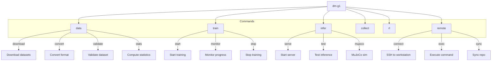
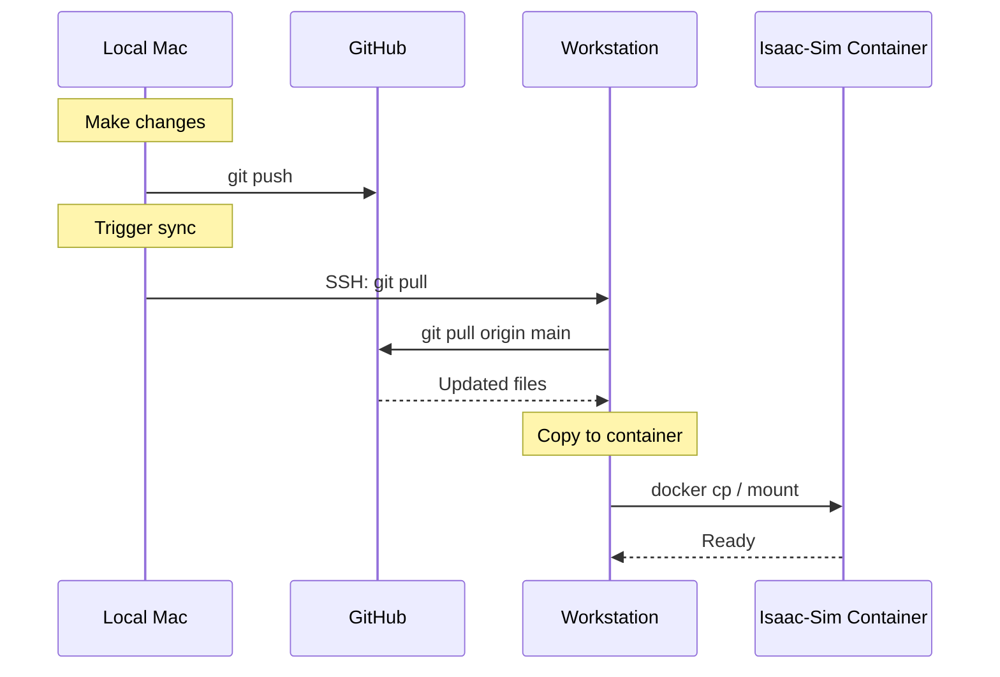

# DM-ISAAC-G1 Repository Restructuring Plan

## Overview

This document outlines the comprehensive plan to restructure `dm-isaac-g1` into a proper Python package with modular architecture for:
- **Fine-tuning**: GROOT N1.6 model fine-tuning for G1 robot
- **Inference**: Model deployment and real-time inference
- **Imitation Learning**: Data collection and behavioral cloning
- **Reinforcement Learning**: Isaac Lab integration for RL training

---

## Current State Analysis

### Existing Structure

```
dm-isaac-g1/
├── .env                    # Credentials and config
├── agent.md               # Workflow rules (needs update)
├── pyproject.toml         # Basic package config
├── README.md
├── configs/               # YAML configs
├── docs/                  # Documentation
├── scripts/               # Mixed utility scripts
├── phases/               # Incomplete phase implementations
│   ├── phase1_inference/
│   ├── phase2_rl/
│   ├── phase3_finetuning/
│   └── phase4_navigation/
├── cleanup/              # Environment references
└── docker/               # Docker compose
```

### Workstation Scripts (Not in Repo)

The following scripts exist on the workstation but are missing from the repository:

| Script | Purpose | Location |
|--------|---------|----------|
| `fix_episodes.py` | Create missing episodes.jsonl and tasks.jsonl | /workspace/scripts/ |
| `split_parquet.py` | Split combined parquet into per-episode files | /workspace/scripts/ |
| `compute_stats.py` | Compute normalization statistics for datasets | /workspace/scripts/ |
| `fix_video_structure.py` | Restructure video directories for GROOT | /workspace/scripts/ |
| `complete_split.py` | Complete partial parquet splits | /workspace/scripts/ |
| `download_dataset.py` | HuggingFace dataset downloader | /workspace/Isaac-GR00T/ |
| `download_all_meta.py` | Download dataset metadata | /workspace/Isaac-GR00T/ |
| `download_meta.py` | Download single dataset metadata | /workspace/Isaac-GR00T/ |
| `download_g1_dataset.py` | G1-specific dataset download | /workspace/Isaac-GR00T/ |
| `g1_teleop_config.py` | Teleop dataset config | /workspace/Isaac-GR00T/ |
| `g1_fold_towel_config.py` | Hospitality task config | /workspace/Isaac-GR00T/ |
| `g1_inspire_simple_config.py` | Simple Inspire config | /workspace/Isaac-GR00T/ |

---

## Target Architecture



---

## Proposed Directory Structure

```
dm-isaac-g1/
├── pyproject.toml              # Package configuration with uv
├── README.md                   # Project overview
├── .env.example                # Environment template
├── .env                        # Local credentials (gitignored)
├── agent.md                    # AI agent workflow rules
│
├── src/
│   └── dm_isaac_g1/           # Main package
│       ├── __init__.py
│       ├── __main__.py        # CLI entry point
│       ├── cli.py             # Click CLI commands
│       │
│       ├── core/              # Core utilities
│       │   ├── __init__.py
│       │   ├── config.py      # Configuration management
│       │   ├── robot.py       # Robot definitions (G1, Inspire)
│       │   ├── remote.py      # SSH/Docker remote execution
│       │   └── logging.py     # Logging configuration
│       │
│       ├── data/              # Dataset management
│       │   ├── __init__.py
│       │   ├── download.py    # HuggingFace downloads
│       │   ├── convert.py     # Format conversions (Dex3→Inspire, etc.)
│       │   ├── validate.py    # Dataset validation
│       │   ├── stats.py       # Statistics computation
│       │   ├── split.py       # Parquet splitting utilities
│       │   ├── video.py       # Video structure fixes
│       │   └── combine.py     # Multi-dataset combination
│       │
│       ├── finetuning/        # GROOT fine-tuning
│       │   ├── __init__.py
│       │   ├── train.py       # Training orchestration
│       │   ├── launch.py      # Multi-GPU launcher
│       │   ├── monitor.py     # Training monitoring
│       │   └── configs/       # Embodiment configurations
│       │       ├── __init__.py
│       │       ├── g1_inspire_53dof.py
│       │       ├── g1_teleop.py
│       │       ├── g1_dex3.py
│       │       └── g1_hospitality.py
│       │
│       ├── inference/         # Model inference
│       │   ├── __init__.py
│       │   ├── client.py      # GROOT client (sync/async)
│       │   ├── server.py      # Inference server wrapper
│       │   ├── mujoco.py      # MuJoCo simulation runner
│       │   └── isaac.py       # Isaac Sim integration
│       │
│       ├── imitation/         # Imitation learning
│       │   ├── __init__.py
│       │   ├── collect.py     # Demonstration collection
│       │   ├── teleop.py      # Teleoperation interface
│       │   ├── replay.py      # Trajectory replay
│       │   └── behavior_cloning.py
│       │
│       └── rl/                # Reinforcement learning
│           ├── __init__.py
│           ├── train.py       # RL training
│           ├── policies/
│           │   ├── __init__.py
│           │   ├── ppo.py
│           │   └── dual_actor.py
│           ├── environments/
│           │   ├── __init__.py
│           │   ├── g1_env.py
│           │   └── rewards.py
│           └── curriculum.py  # Curriculum learning
│
├── configs/                   # Configuration files
│   ├── training.yaml
│   ├── inference.yaml
│   ├── robot/
│   │   ├── g1_inspire.yaml
│   │   └── g1_default.yaml
│   └── datasets/
│       ├── hospitality.yaml
│       └── dex3.yaml
│
├── scripts/                   # Standalone bash scripts
│   ├── setup/
│   │   ├── install.sh         # Package installation
│   │   ├── setup_workstation.sh
│   │   └── setup_container.sh
│   ├── data/
│   │   ├── download_all.sh
│   │   ├── convert_all.sh
│   │   └── validate_all.sh
│   ├── training/
│   │   ├── train_single.sh
│   │   ├── train_multi.sh
│   │   └── monitor.sh
│   └── deploy/
│       ├── deploy_model.sh
│       └── start_server.sh
│
├── docs/
│   ├── README.md              # Documentation index
│   ├── ARCHITECTURE.md        # Architecture overview
│   ├── FINETUNING.md          # Fine-tuning guide
│   ├── INFERENCE.md           # Inference guide
│   ├── IMITATION_LEARNING.md  # IL guide
│   ├── REINFORCEMENT_LEARNING.md # RL guide
│   ├── DATA_PREPARATION.md    # Dataset preparation
│   ├── DEPLOYMENT.md          # Deployment guide
│   └── diagrams/              # Mermaid source files
│       ├── architecture.md
│       ├── data_pipeline.md
│       └── training_workflow.md
│
├── tests/
│   ├── __init__.py
│   ├── conftest.py
│   ├── test_data/
│   ├── test_finetuning/
│   ├── test_inference/
│   └── test_rl/
│
└── docker/
    ├── Dockerfile
    ├── docker-compose.yml
    └── entrypoint.sh
```

---

## Module Specifications

### 1. Core Module (`dm_isaac_g1.core`)



#### `config.py`
```python
# Load and manage configuration from .env and YAML files
class Config:
    workstation_host: str
    workstation_user: str
    groot_server_host: str
    groot_server_port: int
    # ... etc

def load_config() -> Config:
    """Load configuration from .env and environment."""
```

#### `robot.py`
```python
# Robot joint definitions and mappings
@dataclass
class G1InspireRobot:
    body_dof: int = 29
    hand_dof_per_hand: int = 12
    total_dof: int = 53
    joint_names: Dict[str, List[str]]
    joint_indices: Dict[str, Tuple[int, int]]
```

#### `remote.py`
```python
# Remote execution utilities
class WorkstationConnection:
    """SSH connection to Blackwell workstation."""

    def execute(self, command: str) -> str:
        """Execute command via SSH."""

    def docker_exec(self, command: str) -> str:
        """Execute command in isaac-sim container."""
```

### 2. Data Module (`dm_isaac_g1.data`)



#### `download.py`
```python
def download_dataset(
    repo_id: str,
    output_dir: Path,
    subset: Optional[str] = None,
    use_lfs: bool = True,
) -> Path:
    """Download dataset from HuggingFace."""

def download_all_hospitality(output_dir: Path) -> List[Path]:
    """Download all hospitality datasets."""
```

#### `convert.py`
```python
def convert_to_inspire(
    input_path: Path,
    output_path: Path,
    source_hand_type: str,  # "gripper", "dex3", "trifinger"
) -> Path:
    """Convert dataset to 53 DOF Inspire format."""

def gripper_to_inspire(gripper_value: float) -> List[float]:
    """Map gripper (1 DOF) to Inspire hand (12 DOF)."""

def dex3_to_inspire(dex3: List[float]) -> List[float]:
    """Map Dex3 hand (7 DOF) to Inspire hand (12 DOF)."""
```

#### `validate.py`
```python
def validate_dataset(dataset_path: Path) -> ValidationResult:
    """Validate dataset structure and contents."""
    # Check info.json, modality.json, episodes.jsonl
    # Verify parquet schemas
    # Check video file existence
```

### 3. Finetuning Module (`dm_isaac_g1.finetuning`)



#### `train.py`
```python
def train(
    dataset_paths: List[Path],
    output_dir: Path,
    base_model: str = "nvidia/GR00T-N1.6-3B",
    max_steps: int = 10000,
    batch_size: int = 32,
    learning_rate: float = 1e-4,
    save_steps: int = 1000,
    save_total_limit: int = 2,
) -> Path:
    """Run GROOT fine-tuning."""
```

#### `configs/g1_inspire_53dof.py`
```python
# Full 53 DOF Inspire hand configuration
G1_INSPIRE_CONFIG = {
    "video": ModalityConfig(...),
    "state": ModalityConfig(
        modality_keys=[
            "left_leg", "right_leg", "waist",
            "left_arm", "right_arm",
            "left_inspire_hand", "right_inspire_hand",
        ],
    ),
    "action": ModalityConfig(...),
    "language": ModalityConfig(...),
}
```

### 4. Inference Module (`dm_isaac_g1.inference`)



#### `client.py`
```python
class GrootClient:
    """Synchronous client for GROOT inference."""

    def __init__(self, host: str, port: int):
        self.base_url = f"http://{host}:{port}"

    def get_action(
        self,
        observation: np.ndarray,
        image: Optional[np.ndarray] = None,
        task: Optional[str] = None,
    ) -> np.ndarray:
        """Get action from GROOT model."""

class GrootClientAsync:
    """Asynchronous client for GROOT inference."""
```

### 5. Imitation Learning Module (`dm_isaac_g1.imitation`)



#### `collect.py`
```python
class DemonstrationCollector:
    """Collect demonstrations from human teleoperation."""

    def start_recording(self, task_description: str):
        """Start recording a demonstration."""

    def stop_recording(self) -> Episode:
        """Stop recording and return episode data."""

    def save_dataset(self, output_path: Path):
        """Save collected demonstrations as LeRobot dataset."""
```

### 6. RL Module (`dm_isaac_g1.rl`)



#### `train.py`
```python
def train_rl(
    stage: int,
    num_envs: int = 4096,
    max_iterations: int = 10000,
    checkpoint: Optional[Path] = None,
) -> Path:
    """Train G1 with curriculum-based RL."""
```

---

## CLI Design



### CLI Commands

```bash
# Data management
dm-g1 data download --repo unitreerobotics/G1_Fold_Towel
dm-g1 data convert --input ./dataset --output ./converted --format inspire
dm-g1 data validate --path ./dataset
dm-g1 data stats --path ./dataset

# Training
dm-g1 train start --datasets ./data --steps 10000 --batch-size 32
dm-g1 train monitor --job-id abc123
dm-g1 train stop --job-id abc123

# Inference
dm-g1 infer serve --model ./checkpoint --port 5555
dm-g1 infer test --host 192.168.1.237 --port 5555
dm-g1 infer mujoco --model ./checkpoint

# Imitation Learning
dm-g1 collect start --task "Fold towel"
dm-g1 collect replay --episode ./episode.parquet

# Reinforcement Learning
dm-g1 rl train --stage 1 --envs 4096
dm-g1 rl eval --checkpoint ./policy.pt

# Remote operations
dm-g1 remote connect
dm-g1 remote exec "tail -f /tmp/training.log"
dm-g1 remote sync  # Git pull on workstation
```

---

## pyproject.toml Updates

```toml
[project]
name = "dm-isaac-g1"
version = "0.2.0"
description = "G1 Robot Training Suite: Fine-tuning, Inference, IL, and RL"
readme = "README.md"
requires-python = ">=3.10,<3.12"
license = {text = "MIT"}

dependencies = [
    # Core
    "numpy>=1.26.0,<2.0.0",
    "pyyaml>=6.0.1",
    "python-dotenv>=1.0.0",
    "click>=8.1.0",
    "rich>=13.0.0",

    # ML/DL
    "torch>=2.2.0",
    "torchvision>=0.17.0",

    # Data
    "pyarrow>=15.0.0",
    "huggingface-hub>=0.21.0",

    # Network
    "httpx>=0.27.0",
    "paramiko>=3.4.0",

    # Visualization
    "tensorboard>=2.16.0",
    "wandb>=0.16.0",
    "tqdm>=4.66.0",
]

[project.optional-dependencies]
dev = [
    "pytest>=8.0.0",
    "pytest-asyncio>=0.23.0",
    "ruff>=0.3.0",
    "mypy>=1.9.0",
    "pre-commit>=3.6.0",
]
isaac = [
    # Isaac Lab dependencies (installed via Isaac Lab)
]
full = [
    "opencv-python-headless>=4.9.0",
    "pillow>=10.0.0",
    "scipy>=1.12.0",
    "gymnasium>=0.29.0",
]

[project.scripts]
dm-g1 = "dm_isaac_g1.cli:main"

[tool.uv]
dev-dependencies = [
    "pytest>=8.0.0",
    "ruff>=0.3.0",
]

[tool.ruff]
line-length = 100
target-version = "py310"
src = ["src"]

[tool.ruff.lint]
select = ["E", "F", "I", "W", "UP", "B"]
ignore = ["E501"]

[tool.mypy]
python_version = "3.10"
strict = true
```

---

## Git Workflow for Workstation Sync



### Sync Script (`scripts/setup/sync_workstation.sh`)

```bash
#!/bin/bash
# Sync local repository to workstation

set -e
SCRIPT_DIR="$(cd "$(dirname "${BASH_SOURCE[0]}")" && pwd)"
PROJECT_ROOT="$(dirname "$(dirname "$SCRIPT_DIR")")"
source "$PROJECT_ROOT/.env"

# Push local changes
echo "Pushing local changes..."
git push origin main

# Pull on workstation
echo "Pulling on workstation..."
sshpass -p "$WORKSTATION_PASSWORD" ssh -o StrictHostKeyChecking=no \
    "$WORKSTATION_USER@$WORKSTATION_HOST" \
    "cd /home/$WORKSTATION_USER/dm-isaac-g1 && git pull origin main"

# Sync to container
echo "Syncing to container..."
sshpass -p "$WORKSTATION_PASSWORD" ssh -o StrictHostKeyChecking=no \
    "$WORKSTATION_USER@$WORKSTATION_HOST" \
    "docker cp /home/$WORKSTATION_USER/dm-isaac-g1 isaac-sim:/workspace/"

echo "Sync complete!"
```

---

## Implementation Phases

### Phase 1: Core Infrastructure (Week 1)
1. [ ] Create new `src/dm_isaac_g1` package structure
2. [ ] Implement `core` module (config, robot, remote)
3. [ ] Set up CLI framework with Click
4. [ ] Update `pyproject.toml` for uv
5. [ ] Add git sync workflow to `agent.md`

### Phase 2: Data Pipeline (Week 1-2)
1. [ ] Port workstation scripts to `data` module
2. [ ] Implement download, convert, validate, stats
3. [ ] Add CLI commands for data operations
4. [ ] Create data preparation documentation

### Phase 3: Fine-tuning (Week 2)
1. [ ] Implement `finetuning` module
2. [ ] Port embodiment configurations
3. [ ] Add training monitoring
4. [ ] Create fine-tuning documentation

### Phase 4: Inference (Week 2-3)
1. [ ] Implement `inference` module
2. [ ] Port GrootClient from phases/
3. [ ] Add MuJoCo simulation runner
4. [ ] Create inference documentation

### Phase 5: IL & RL (Week 3)
1. [ ] Implement `imitation` module
2. [ ] Implement `rl` module
3. [ ] Port existing PPO implementation
4. [ ] Create IL/RL documentation

### Phase 6: Testing & Polish (Week 4)
1. [ ] Add comprehensive tests
2. [ ] Create example scripts
3. [ ] Update all documentation with Mermaid
4. [ ] Final review and cleanup

---

## Migration Checklist

### Files to Migrate from Current Structure

| Source | Destination | Action |
|--------|-------------|--------|
| `scripts/convert_to_inspire.py` | `src/dm_isaac_g1/data/convert.py` | Refactor |
| `scripts/combine_inspire_datasets.py` | `src/dm_isaac_g1/data/combine.py` | Refactor |
| `scripts/g1_inspire_unified_config.py` | `src/dm_isaac_g1/finetuning/configs/` | Move |
| `scripts/policy_inference_mujoco.py` | `src/dm_isaac_g1/inference/mujoco.py` | Refactor |
| `phases/phase1_inference/groot_client.py` | `src/dm_isaac_g1/inference/client.py` | Refactor |
| `phases/phase2_rl/train.py` | `src/dm_isaac_g1/rl/train.py` | Refactor |
| `phases/phase2_rl/rewards.py` | `src/dm_isaac_g1/rl/environments/rewards.py` | Move |
| `phases/phase2_rl/g1_env.py` | `src/dm_isaac_g1/rl/environments/g1_env.py` | Move |

### Files to Migrate from Workstation

| Source | Destination | Action |
|--------|-------------|--------|
| `/workspace/scripts/fix_episodes.py` | `src/dm_isaac_g1/data/validate.py` | Integrate |
| `/workspace/scripts/split_parquet.py` | `src/dm_isaac_g1/data/split.py` | Refactor |
| `/workspace/scripts/compute_stats.py` | `src/dm_isaac_g1/data/stats.py` | Refactor |
| `/workspace/scripts/fix_video_structure.py` | `src/dm_isaac_g1/data/video.py` | Refactor |
| `/workspace/Isaac-GR00T/download_*.py` | `src/dm_isaac_g1/data/download.py` | Consolidate |
| `/workspace/Isaac-GR00T/g1_*_config.py` | `src/dm_isaac_g1/finetuning/configs/` | Move |

---

## Success Criteria

1. **Installable Package**: `uv pip install -e .` works
2. **CLI Functional**: `dm-g1 --help` shows all commands
3. **Workstation Sync**: `dm-g1 remote sync` updates workstation code
4. **Training Works**: Can launch fine-tuning from CLI
5. **Tests Pass**: `pytest` runs successfully
6. **Documentation Complete**: All modules have Mermaid diagrams

---

## References

- [GROOT N1.6](https://huggingface.co/nvidia/GR00T-N1.6-3B) - Base model
- [Isaac-GR00T](https://github.com/NVIDIA/Isaac-GR00T) - Fine-tuning framework
- [Isaac Lab](https://github.com/isaac-sim/IsaacLab) - RL training
- [LeRobot](https://github.com/huggingface/lerobot) - Dataset format
- [uv](https://github.com/astral-sh/uv) - Package manager
